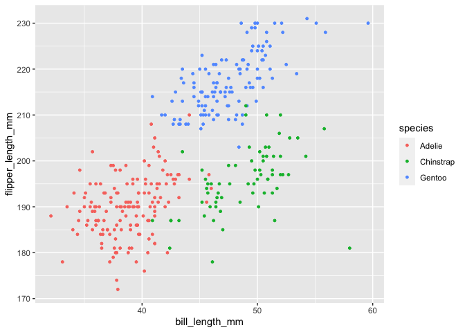

p8105\_hw1\_pl2811
================
Pei Hsin Lin
9/28/2021

\#Problem 1

``` r
a <- c(rnorm(10))
a
```

    ##  [1] -1.435143528 -1.533784435  0.681264291 -0.818347750 -0.002350101
    ##  [6] -0.748252304  0.220458453  0.065979170  0.457960749  0.859581075

a random sample of size 10 from a standard Normal distribution

``` r
b <- c(a>0)
b
```

    ##  [1] FALSE FALSE  TRUE FALSE FALSE FALSE  TRUE  TRUE  TRUE  TRUE

a logical vector indicating whether elements of the sample are greater
than 0

``` r
c <- c("p8105", "howework", "one","problem", "one", "character","vector","of","length","ten")
c
```

    ##  [1] "p8105"     "howework"  "one"       "problem"   "one"       "character"
    ##  [7] "vector"    "of"        "length"    "ten"

a character vector of length 10

``` r
d <- factor(c("breakfast", "lunch", "dinner", "dinner","lunch", "breakfast","dinner","lunch","dinner","breakfast"));
d
```

    ##  [1] breakfast lunch     dinner    dinner    lunch     breakfast dinner   
    ##  [8] lunch     dinner    breakfast
    ## Levels: breakfast dinner lunch

a factor vector of length 10, with 3 different factor “levels”

``` r
df <- data.frame(a,b,c,d)
df
```

    ##               a     b         c         d
    ## 1  -1.435143528 FALSE     p8105 breakfast
    ## 2  -1.533784435 FALSE  howework     lunch
    ## 3   0.681264291  TRUE       one    dinner
    ## 4  -0.818347750 FALSE   problem    dinner
    ## 5  -0.002350101 FALSE       one     lunch
    ## 6  -0.748252304 FALSE character breakfast
    ## 7   0.220458453  TRUE    vector    dinner
    ## 8   0.065979170  TRUE        of     lunch
    ## 9   0.457960749  TRUE    length    dinner
    ## 10  0.859581075  TRUE       ten breakfast

put them together in a data frame

``` r
df %>%
pull(a)%>%
mean()
```

    ## [1] -0.2252634

The mean of the this normal distribution is -0.2191412.

``` r
df %>%
pull(b)%>%
mean()
```

    ## [1] 0.5

The mean of the logical vector is 0.4. R caculate FALSE as 0, TRUE as 1.

``` r
df %>%
pull(c)%>%
mean()
```

    ## Warning in mean.default(.): argument is not numeric or logical: returning NA

    ## [1] NA

The mean of the character vector turn out to be NA. It is because
character vector is not numeric.

``` r
df %>%
pull(d)%>%
mean()
```

    ## Warning in mean.default(.): argument is not numeric or logical: returning NA

    ## [1] NA

The mean of the factor vector turn out to be NA. It is because factor
vector is not numeric.

``` r
as.numeric(b)
as.numeric(c)
```

    ## Warning: NAs introduced by coercion

``` r
as.numeric(d)
```

In logical vector, if we use as.numeric, R will made FALSE into 0, TRUE
into 1.

In character vector, as.numeric won’t work.

In factor vector, if we use as.numeric, R will assigns the numbers
1,2,3,4 and so on depend on how many level this factor vector has.

\#Problem 2

``` r
data("penguins", package = "palmerpenguins")
summary(penguins)
```

    ##       species          island    bill_length_mm  bill_depth_mm  
    ##  Adelie   :152   Biscoe   :168   Min.   :32.10   Min.   :13.10  
    ##  Chinstrap: 68   Dream    :124   1st Qu.:39.23   1st Qu.:15.60  
    ##  Gentoo   :124   Torgersen: 52   Median :44.45   Median :17.30  
    ##                                  Mean   :43.92   Mean   :17.15  
    ##                                  3rd Qu.:48.50   3rd Qu.:18.70  
    ##                                  Max.   :59.60   Max.   :21.50  
    ##                                  NA's   :2       NA's   :2      
    ##  flipper_length_mm  body_mass_g       sex           year     
    ##  Min.   :172.0     Min.   :2700   female:165   Min.   :2007  
    ##  1st Qu.:190.0     1st Qu.:3550   male  :168   1st Qu.:2007  
    ##  Median :197.0     Median :4050   NA's  : 11   Median :2008  
    ##  Mean   :200.9     Mean   :4202                Mean   :2008  
    ##  3rd Qu.:213.0     3rd Qu.:4750                3rd Qu.:2009  
    ##  Max.   :231.0     Max.   :6300                Max.   :2009  
    ##  NA's   :2         NA's   :2

There are 8 variales in the penguins data set, numerical variable
including bill\_length\_mm, bill\_depth\_mm , flipper\_length\_mm,
body\_mass\_g. Categorical variable including species, island, sex,
year.

``` r
nrow(penguins)
```

    ## [1] 344

``` r
ncol(penguins)
```

    ## [1] 8

``` r
mean(pull(penguins, name="flipper_length_mm"))
```

    ## [1] 2008.029

There are 344 rows, 8 columns in the penguins data.

``` r
penguins_plot=ggplot(penguins, 
                     aes(x=bill_length_mm, y=flipper_length_mm, color=species))+
  geom_point(size=1)

penguins_plot
```

    ## Warning: Removed 2 rows containing missing values (geom_point).

<!-- -->

``` r
ggsave("penguins.pdf",penguins_plot)
```

    ## Saving 7 x 5 in image

    ## Warning: Removed 2 rows containing missing values (geom_point).
